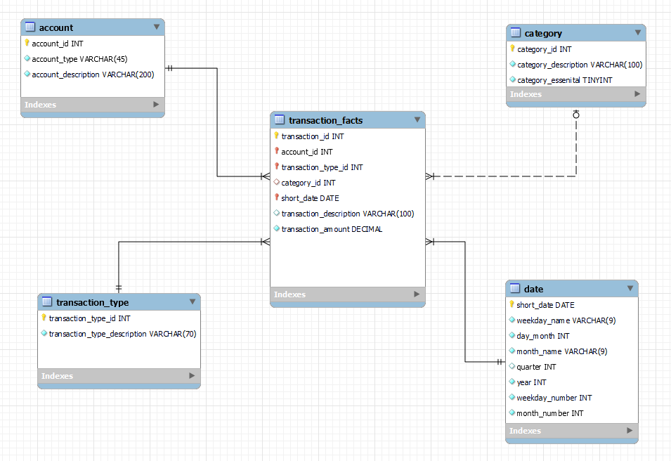

# Personal Finance Database and Dashboard
In this project, I developed a MySQL database called "spend_save" tracking all of my financial transactions. This includes purchases, deposits, withdraws, credit card payments, and more. Any transaction that results in a change in a bank account or credit card balance is tracked in this database. These transactions are extracted from my banking website in the form of CSV files, transformed using customized Python scripts, and loaded into the database via the sqlalchemy Python library. I then created SQL views to understand my spending habits and developed a Power BI dashboard linked to the database to view these habits visually.

## Technologies/Skills
- SQL (MySQL), MySQL Workbench, Python (NumPy, Pandas, SQLAlchemy), Power BI, DAX
- Data modeling, database development, data wrangling, data cleaning, ETL, data analysis, data visualization/dashboarding

## Inspiration
I wanted to know more about my spending habits. I had an idea of which categories I spent the most on, but I did not know exactly how much I was spending. I also wanted to have a way to track my spending habits over time, allowing me to see which months of the year I tend to spend the most money in. To a lesser degree, I also wanted to track my bank account balances over time.

---

## Identifying Requirements 
My primary objective was to create a system that could meticulously monitor every transaction flowing through my bank and credit card accounts. I aimed to capture crucial details such as transaction categories, transaction types (credit card purchases, paychecks, credit card bill payments, etc.), and transaction dates. To do so, I needed to extract data on the __transaction level__ from my bank and credit card accounts.

## Data Modeling
To achieve the desired requirements above, I opted to create a dimensional model consisting of 4 dimension tables and one fact table as seen below:

The `account`, `transaction_type`, `category`, and `date` tables are all dimensional tables, providing more information about each transaction in the transaction_facts table. However, as indicated on the data model, the `category` dimension is optional. This is because only transactions flagged as a transaction type of debit or credit card purchase are marked with a category and is enforced via a check constraint.

To gain a better understanding of the schema tables and relationships, check out the [database_creation](data dictionary/data_dictionary.md).

## Database Creation

The creation of the database creation was performed via the "forward engineer" feature of MySQL Workbench. Additionally, the check constraint mentioned above was added. To view full creation script, view [final database creation script](database_creation/final_database_creation_script.sql).

## Loading Data into Dimensional Tables

Data was loaded into the dimension tables in the form of CSV files. To view this data, see the [dimensions table data](database_creation/dimensions_data) folder.

## Transactions Processing and Loading into transactions_facts

The transactions were loaded into the database from various accounts listed in the account dimension table, including savings accounts, checking accounts, and credit cards. I extracted the account data manually from my online banking website as separate CSV files for each type of account. Afterward, I imported the data into a Jupyter Notebook and applied individual transformations via Python to each dataset. I created custom functions to automate most of this process, minimizing the need for manual intervention. In cases where the Python functions could not process transactions accurately, I reviewed them manually. You can find the functions used for transaction processing in the [transactions processing functions](transactions_processing/transactions_processing_functions.py).

To view an example of processing transactions for each account, view the respective Jupyter Notebook linked below:
  - [Savings transactions processing](transactions_processing/savings_processing_example.ipynb)
  - [Checking transactions processing](transactions_processing/checking_processing_example.ipynb)
  - [Credit card transactions processing](transactions_processing/cc_processing_example.ipynb)

Please note that the data presented here is based on my real banking data from May. However, for privacy reasons, all the information in the database and dashboard has been modified, including transaction dates, descriptions, amounts, and other relevant details.

---

## SQL Analysis and Database Views Creation

Once I had set up the spend_save database, my next goal was to generate queries that could provide me with insights into my spending and saving patterns. I wanted to examine monthly expenses, categorical spending amounts, and observe fluctuations in my account balances/spending. Since I needed to access this information frequently, I decided to create database views for convenient and quick access. To see the SQL code of how these views were created and sample outputs, see the [database views overview](database_views/views_overview.ipynb).

## Power BI Dashboard
In addition to the database views, I wanted a visual representation of my spending habits. I chose to create a Power BI dashboard for this purpose. I imported all the tables from the spend_save database, along with one view created in the previous step. To view the data model for the dashboard, see the [dashboard data model](dashboard/dashboard_model.png). The annotated picture below provides an overview of the dashboard with descriptions for each visual:

Please note that the data displayed in this dashboard has been altered to render inaccurate spending amounts. However, the proportions spent in each category remain accurate.

[Click here if you would like to see the interactiv dashboard,](https://app.powerbi.com/view?r=eyJrIjoiOThlZWM3YjMtODZhNy00MTIwLWIzMjAtMTBlMjUzNTczMGQwIiwidCI6IjVmODc4N2Q0LThkNmYtNGI1ZC1hNWY4LTM3MzI0YWFhZDYwMSJ9)

From the dashboard, it is evident that a significant portion of my expenses during the first six months of 2023 was attributed to non-essential items, particularly food & drink, including dining out at restaurants. This information is eye-opening, as I was aware of my tendency to spend on dining out but underestimated the extent of it. Furthermore, the highest expenditure months were observed in the colder months of January, February, and March, which was unexpected.

Overall, this dashboard and database serve as valuable tools for effectively monitoring my finances. The two tools enable me to track my spending, identify areas where I can make improvements, and ultimately strengthen my personal financial position.
